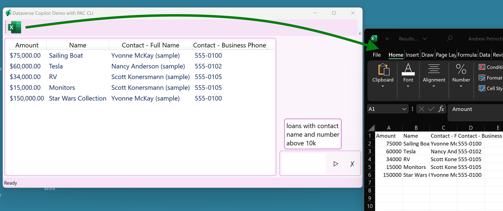

# DataverseSamples

## Dataverse AI Assistant / Copilot Demos

- [Find Dataverse Solution and send email to owner](https://github.com/petrochuk/DataverseSamples/blob/main/src/AP2/docs/Demos.md#send-email)
- [Translate Table Descriptions](https://github.com/petrochuk/DataverseSamples/blob/main/src/AP2/docs/Demos.md#translate-table-descriptions)
- [Ask questions about Table Properties](https://github.com/petrochuk/DataverseSamples/blob/main/src/AP2/docs/Demos.md#table-properties)
- [Ask questions about Canvas Apps](https://github.com/petrochuk/DataverseSamples/blob/main/src/AP2/docs/Demos.md#canvas-app-properties)

## Dataverse Copilot Demo with PAC CLI

This sample demonstrates how to create a simple Dataverse Copilot using [Azure OpenAI](https://azure.microsoft.com/en-us/products/cognitive-services/openai-service),
with help of [Power Platform CLI library](https://learn.microsoft.com/en-us/power-platform/developer/cli/introduction) 
to clean and prepare FetchXML queries, access data stored in Dataverse, plus [embeddings with Azure OpenAI](https://learn.microsoft.com/en-us/azure/cognitive-services/openai/how-to/embeddings?tabs=console)
to enrich prompt with table metadata.

There is no need to modify your Dataverse environment. It can connect to any current production Microsoft Dataverse environment.

The sample can use chat or completion API with [ChatGPT-3.5 turbo or ChatGPT-4](https://learn.microsoft.com/en-us/azure/cognitive-services/openai/how-to/chatgpt?pivots=programming-language-chat-completions)
model.

OpenAI and Dataverse endpoints can be configured in the `appSettings.json` file.

### Interact with data in Dataverse 

### Using custom tables with joins and filters

### Export to Excel

Ask Copilot for any data from Dataverse and export it to Excel

### Functional flow block diagram

1. User types query in natural language for example: "show me all accounts"	
2. The Copilot example app adds system prompt to the query: "return only FetchXML queries" to instruct AI model to respond with FetchXML queries only
3. AL model resonds with FetchXML query but it cannot be executed because metadata doesn't match current Dataverse environment
4. The app modifies the FetchXML query to fix metadata for tables, attributes, links etc by quering Dataverse metadata API
5. After query matches current Dataverse environment the app executes the query and displays results
6. User can clarify and imporve the query by adding more details like "with name coffee" and chat process starts over again at step 2

